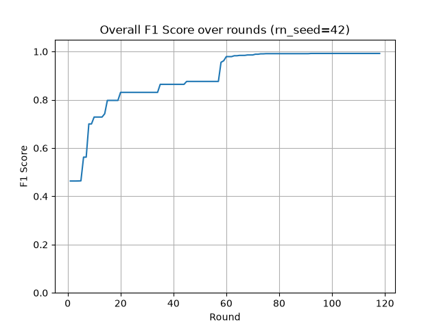
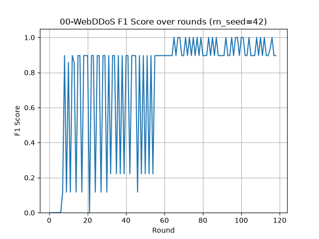
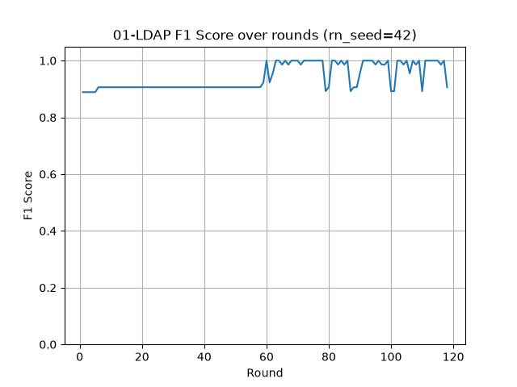

# FLAD Adaptive Federated Learning for DDoS attack detection

> [!NOTE] 
> If you use this baseline in your work, please remember to cite the original authors of the paper as well as the Flower paper.

**Paper:** [FLAD: Adaptive Federated Learning for DDoS Attack Detection. Computers & Security 137 (2024): 103597.](https://doi.org/10.1016/j.cose.2023.103597)

**Authors:** Roberto Doriguzzi-Corin, Domenico Siracusa

**Abstract:** Federated Learning (FL) has been recently receiving increasing consideration from the cybersecurity community as a way to collaboratively train deep learning models with distributed profiles of cyber threats, with no disclosure of training data. Nevertheless, the adoption of FL in cybersecurity is still in its infancy, and a range of practical aspects have not been properly addressed yet. Indeed, the Federated Averaging algorithm at the core of the FL concept requires the availability of test data to control the FL process. Although this might be feasible in some domains, test network traffic of newly discovered attacks cannot be always shared without disclosing sensitive information. In this paper, we address the convergence of the FL process in dynamic cybersecurity scenarios, where the trained model must be frequently updated with new recent attack profiles to empower all members of the federation with the latest detection features. To this aim, we propose FLAD (Adaptive Federated Learning Approach to DDoS attack detection), an FL solution for cybersecurity applications based on an adaptive mechanism that orchestrates the FL process by dynamically assigning more computation to those members whose attacks profiles are harder to learn, without the need of sharing any test data to monitor the performance of the trained model. Using a recent dataset of DDoS attacks, we demonstrate that FLAD outperforms state-of-the-art FL algorithms in terms of convergence time and accuracy across a range of unbalanced datasets of heterogeneous DDoS attacks. We also show the robustness of our approach in a realistic scenario, where we retrain the deep learning model multiple times to introduce the profiles of new attacks on a pre-trained model. 


## About this baseline

**What’s implemented:** The code in this baseline reproduces a portion of the experiments presented in the aforementioned paper, specifically those evaluating convergence behavior of the FLAD strategy on a highly non-i.i.d dataset of heterogeneous DDoS attacks. In particular, it shows how FLAD converges to high F1 scores within a relatively small number of FL rounds (Table 5 and Figure 4). This baseline does **not** include the comparative evaluation against other FL strategies (e.g. FedAvg) presented in the original paper. 

**Datasets:** The dataset used for the experimentation is a preprocessed, repartitioned derivative of the CIC-DDoS2019 dataset originally by the Canadian Institute for Cybersecurity of the University of New Brunswick (UNB). More details about the CIC-DDoS2019 dataset can be found on [this page](https://www.unb.ca/cic/datasets/ddos-2019.html) and in the following scientific paper:

*Iman Sharafaldin, Arash Habibi Lashkari, Saqib Hakak, and Ali A. Ghorbani, "Developing Realistic Distributed Denial of Service (DDoS) Attack Dataset and Taxonomy", IEEE 53rd International Carnahan Conference on Security Technology, Chennai, India, 2019.*

This derived version, named `DOS2019_highly_unbalanced`, is available on the [Hugging Face Hub](https://huggingface.co/datasets/silviocretti/DOS2019_highly_unbalanced). 

**Hardware Setup:** The experiments were run on a server-class computer equipped with two 8-core Intel Xeon Silver 4110 @2.1 GHz CPUs and 64 GB of RAM. Each run took approximately 30 minutes to complete. No GPU is required since the experiments run on CPU only.

**Contributors:** Roberto Doriguzzi-Corin, Silvio Cretti


## Experimental Setup

**Task:** Network intrusion detection, specifically the detection of Distributed Denial of Service (DDoS) attacks.

**Model:** FLAD uses a fully connected neural network model (MLP) that consists of an input layer of shape n × f neurons, a single-neuron output layer, and l hidden dense layers of m neurons each.
The following table summarizes the model architecture used in the experiments.
For more details please check section 7.2 of the paper.

| Layer (type)                    | Output Shape           |       Params  |
|---------------------------------|------------------------|---------------|
| flatten (Flatten)               | (None, 110)            |             0 |
| fc0 (Dense)                     | (None, 32)             |         3,552 |
| fc1 (Dense)                     | (None, 32)             |         1,056 |
| fc3 (Dense)                     | (None, 1)              |            33 |

The output of the model is a number between 0 and 1, which represents the probability of the network flow being malicious.

**Dataset:** The [`DOS2019_highly_unbalanced`](https://huggingface.co/datasets/silviocretti/DOS2019_highly_unbalanced) dataset contains network flows partitioned per attack-type/client_id, converted from HDF5 to Parquet, and consolidated into three splits (`train`, `val`, `test`).
Each split (`train.parquet` - ~80% of the whole dataset, `val.parquet` - ~10%, `test.parquet` - ~10%) contains one row per network flow sample, with the following columns:

| Column      | Type            | Description                                                    |
|-------------|-----------------|------------------------------------------------------------------|
| `client_id` | `string`        | Attack-type / client partition the sample belongs to (e.g. `"11-NetBIOS"`) |
| `features`  | `list<float32>` | Flattened feature window; reshape to `(10, 11)` per sample to restore the original layout |
| `label`     | `int64`         | `0` = benign, `1` = malicious                                  |

Samples are grouped by `client_id`, mirroring the original per-client HDF5 directory structure, used in the FLAD experimentation. 

The original HDF5 structure, needed for the experimentation, can be reconstructed using the `./scripts/prepare_dataset.py` script (see below). It comprises 13 clients X 3 splits = 39 HDF5 files in the form of arrays of shape n = 10 rows and f = 11 columns, where n is the number of packets of a network flow and f is the number of features. The 11 features are the following:

*Time, Packet Length, Highest Protocol, IP Flags, Protocols, TCP Length, TCP Ack, TCP Flags, TCP Window Size, UDP Length and ICMP Type*

Each client contains samples of benign traffic and only one type of attack. Although each group has been balanced to ensure an approximately equal distribution between benign and DDoS samples, the partition across groups/clients is strongly non-i.i.d since each one represents a single attack type.

**Training Hyperparameters:** The following table shows the hyperparameters used in the experiments. For more details please check section 7.3 of the paper.

| Name        | Value | Description |
|-------------|-------|-------------|
| PATIENCE    | 25    | Stop when the number of consecutive rounds with no progress exceeds this value.  |
| Min epochs  | 1     | Min number of local training epochs. |
| Max epochs  | 5     | Max number of local training epochs. |
| Min steps   | 10    | Min number MBGD steps. |
| Max steps   | 1000  | Max number MBGD steps. |
| n × f       | 10 × 11 | Size of the MLP input layer. |
| l          | 2     | Number of hidden layers. |
| m          | 32    | Number of neurons/layer. |


## Environment Setup

Install `pyenv` following the instructions in the [pyenv GitHub repository](https://github.com/pyenv/pyenv).

To build the environment, you can use the following commands:

```bash
# Install Python 3.12.12
pyenv install 3.12.12

# Create the virtual environment
pyenv virtualenv 3.12.12 flad

# Activate it
pyenv activate flad

# Install the baseline
cd baselines/flad
pip install -e .
```

To download and reconstruct the dataset in HDF5 format, use the following command:

```bash
python scripts/prepare_dataset.py --repo-id silviocretti/DOS2019_highly_unbalanced
```
By default, the dataset will be saved in `./dataset/DOS2019_highly_unbalanced`. You can also specify a different output folder with the `--output-folder` parameter but recall to keep it coherent with the `dataset-folder` parameter in `./pyproject.toml`:

## Running the Experiments

In FLAD, clients are considered "pets", not "cattle": each client is identified by name and
can be treated differently by the server than the other clients. For this reason, the
FLAD strategy assigns a name to each client. In `./pyproject.toml` you can find the `client_names` parameter — a comma-separated string of client names used to identify each client. 

Unlike other strategies, FLAD does not use a fixed number of rounds — it dynamically
decides when to stop training based on the clients' F1 score. Setting `num-server-rounds` to
`0` in `./pyproject.toml` enables this behavior.

Finally, since much of FLAD's behavior is driven by each client's F1 score, this metric must be returned during the evaluation phase.

To run a single experiment of this baseline, do:

```bash
flwr run . --federation-config="num-supernodes=13 client-resources-num-cpus=2" --stream
```

In the `output_folder` specified in the `pyproject.toml` file, you will find a directory whose name is `federated_training_flad_<rn_seed>-<yyyymmdd>-<hhmmss>`. Inside that directory, you can find the best model (`model.keras`) and the training history file. 

In order to run 10 experiments with different random seeds, you can use this script:

```bash
./scripts/run_experiments.sh
```
Selected random seeds are provided in the `SEEDS` array within the `scripts/run_experiments.sh` script.

### Troubleshooting

If you hit OOM errors during training, you can try running the experiments with
`tcmalloc` preloaded instead of the default glibc allocator. To do this, install
`libtcmalloc-minimal4t64` (or the equivalent package for your OS) and export it via
`LD_PRELOAD`:

```bash
# Ubuntu/Debian
sudo apt install libtcmalloc-minimal4t64
export LD_PRELOAD=/usr/lib/x86_64-linux-gnu/libtcmalloc_minimal.so.4
```

### Processing the Results

Results can be processed with the following commands.

```bash
python scripts/summary.py --log-dir LOG_DIR
```
Given the `LOG_DIR` of a set of experiments (where results are stored - corresponding to the field `output_folder` in the `./pyproject.toml` file), it produces a summary table of results.

```bash
python scripts/process_results.py --rn-seed RN_SEED [--client-name CLIENT_NAME] --log-dir LOG_DIR 
```

Given the `LOG_DIR` of a set of experiments (where results are stored - corresponding to the field `output_folder` in the `./pyproject.toml` file), the `RN_SEED` that identifies a specific experiment, and optionally a `CLIENT_NAME`, it produces a plot of the F1 score over the FL rounds. If `CLIENT_NAME` is not provided, the overall F1 score is plotted. If `CLIENT_NAME` is provided, the F1 score for that specific client is plotted.
By default, plots are saved in the `_static` directory. 

Note that the results obtained may vary slightly from the original paper due to differences in the random seeds used.

An example of the output plot for the overall F1 score is shown below:



An example of the output plot for two clients F1 score is shown below:



